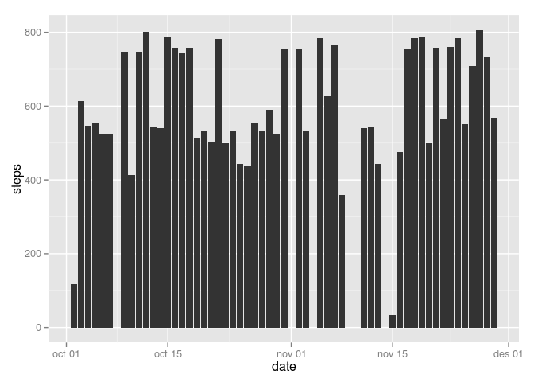

# Reproducible Research: Peer Assessment 1


## Loading and preprocessing the data

### Unzip data file.

The original file is a csv file compressed into a zip.  
We uncompress the file **activity.zip** and store the uncompressed filename into *filename* variable.


Let's load library dplyr to process and transform data in order to be able to work with it.  


```r
library(dplyr)
```

```
## 
## Attaching package: 'dplyr'
## 
## The following objects are masked from 'package:stats':
## 
##     filter, lag
## 
## The following objects are masked from 'package:base':
## 
##     intersect, setdiff, setequal, union
```

```r
library(ggplot2)
library(xtable)
library(timeDate)
```

```
## 
## Attaching package: 'timeDate'
## 
## The following object is masked from 'package:xtable':
## 
##     align
```


```r
filename = unzip("activity.zip",overwrite = TRUE)
print (filename)
```

```
## [1] "./activity.csv"
```

After having the datafile uncompressed we can import that data, into a *data.frame* called **data**.


```r
data = read.table(filename,header = TRUE,sep = ",",stringsAsFactors=FALSE )
head (data)
```

```
##   steps       date interval
## 1    NA 2012-10-01        0
## 2    NA 2012-10-01        5
## 3    NA 2012-10-01       10
## 4    NA 2012-10-01       15
## 5    NA 2012-10-01       20
## 6    NA 2012-10-01       25
```


## What is mean total number of steps taken per day?

### Group data by date.

We group data by date in order to operate with those groups of information.

Then we will use group_by, from dplyr,  to have a table grouped by date and to be able to find on mean steps in daily data.

In this step we ignore the NA values.

After this point we will have the folloing variables:   
- **data:** Full raw data from file  
- **table:** Full data without NA and grouped by data.  
- **step_mean:** Table with daily step means  
- **steps_interval:** Table grouped by intervals.  
- **steps_total:** Total sum of steps per day.


```r
table = na.omit (data)
table = group_by(table,date)
intervals = na.omit(data)
intervals = group_by(table,interval)

table$date = as.POSIXct(table$date)
step_mean = summarize(table,mean(steps))
colnames(step_mean) = c ( "date", "meanSteps")

steps_interval = summarize(intervals,mean(steps),median(steps))
colnames(steps_interval) = c("interval", "meanSteps","medianSteps")

steps_total = summarize(table,sum(steps))
colnames(steps_total) = c("date","steps")
steps_total
```

```
## Source: local data frame [53 x 2]
## 
##          date steps
## 1  2012-10-02   126
## 2  2012-10-03 11352
## 3  2012-10-04 12116
## 4  2012-10-05 13294
## 5  2012-10-06 15420
## 6  2012-10-07 11015
## 7  2012-10-09 12811
## 8  2012-10-10  9900
## 9  2012-10-11 10304
## 10 2012-10-12 17382
## ..        ...   ...
```

Reporting the steps mean per day
Print the mean values in a table:


```r
xt = xtable (step_mean)
print ( xt, type="html")
```

<!-- html table generated in R 3.2.1 by xtable 1.7-1 package -->
<!-- Mon Jul 20 00:16:55 2015 -->
<TABLE border=1>
<TR> <TH>  </TH> <TH> date </TH> <TH> meanSteps </TH>  </TR>
  <TR> <TD align="right"> 1 </TD> <TD> 2012-10-02 </TD> <TD align="right"> 0.44 </TD> </TR>
  <TR> <TD align="right"> 2 </TD> <TD> 2012-10-03 </TD> <TD align="right"> 39.42 </TD> </TR>
  <TR> <TD align="right"> 3 </TD> <TD> 2012-10-04 </TD> <TD align="right"> 42.07 </TD> </TR>
  <TR> <TD align="right"> 4 </TD> <TD> 2012-10-05 </TD> <TD align="right"> 46.16 </TD> </TR>
  <TR> <TD align="right"> 5 </TD> <TD> 2012-10-06 </TD> <TD align="right"> 53.54 </TD> </TR>
  <TR> <TD align="right"> 6 </TD> <TD> 2012-10-07 </TD> <TD align="right"> 38.25 </TD> </TR>
  <TR> <TD align="right"> 7 </TD> <TD> 2012-10-09 </TD> <TD align="right"> 44.48 </TD> </TR>
  <TR> <TD align="right"> 8 </TD> <TD> 2012-10-10 </TD> <TD align="right"> 34.38 </TD> </TR>
  <TR> <TD align="right"> 9 </TD> <TD> 2012-10-11 </TD> <TD align="right"> 35.78 </TD> </TR>
  <TR> <TD align="right"> 10 </TD> <TD> 2012-10-12 </TD> <TD align="right"> 60.35 </TD> </TR>
  <TR> <TD align="right"> 11 </TD> <TD> 2012-10-13 </TD> <TD align="right"> 43.15 </TD> </TR>
  <TR> <TD align="right"> 12 </TD> <TD> 2012-10-14 </TD> <TD align="right"> 52.42 </TD> </TR>
  <TR> <TD align="right"> 13 </TD> <TD> 2012-10-15 </TD> <TD align="right"> 35.20 </TD> </TR>
  <TR> <TD align="right"> 14 </TD> <TD> 2012-10-16 </TD> <TD align="right"> 52.38 </TD> </TR>
  <TR> <TD align="right"> 15 </TD> <TD> 2012-10-17 </TD> <TD align="right"> 46.71 </TD> </TR>
  <TR> <TD align="right"> 16 </TD> <TD> 2012-10-18 </TD> <TD align="right"> 34.92 </TD> </TR>
  <TR> <TD align="right"> 17 </TD> <TD> 2012-10-19 </TD> <TD align="right"> 41.07 </TD> </TR>
  <TR> <TD align="right"> 18 </TD> <TD> 2012-10-20 </TD> <TD align="right"> 36.09 </TD> </TR>
  <TR> <TD align="right"> 19 </TD> <TD> 2012-10-21 </TD> <TD align="right"> 30.63 </TD> </TR>
  <TR> <TD align="right"> 20 </TD> <TD> 2012-10-22 </TD> <TD align="right"> 46.74 </TD> </TR>
  <TR> <TD align="right"> 21 </TD> <TD> 2012-10-23 </TD> <TD align="right"> 30.97 </TD> </TR>
  <TR> <TD align="right"> 22 </TD> <TD> 2012-10-24 </TD> <TD align="right"> 29.01 </TD> </TR>
  <TR> <TD align="right"> 23 </TD> <TD> 2012-10-25 </TD> <TD align="right"> 8.65 </TD> </TR>
  <TR> <TD align="right"> 24 </TD> <TD> 2012-10-26 </TD> <TD align="right"> 23.53 </TD> </TR>
  <TR> <TD align="right"> 25 </TD> <TD> 2012-10-27 </TD> <TD align="right"> 35.14 </TD> </TR>
  <TR> <TD align="right"> 26 </TD> <TD> 2012-10-28 </TD> <TD align="right"> 39.78 </TD> </TR>
  <TR> <TD align="right"> 27 </TD> <TD> 2012-10-29 </TD> <TD align="right"> 17.42 </TD> </TR>
  <TR> <TD align="right"> 28 </TD> <TD> 2012-10-30 </TD> <TD align="right"> 34.09 </TD> </TR>
  <TR> <TD align="right"> 29 </TD> <TD> 2012-10-31 </TD> <TD align="right"> 53.52 </TD> </TR>
  <TR> <TD align="right"> 30 </TD> <TD> 2012-11-02 </TD> <TD align="right"> 36.81 </TD> </TR>
  <TR> <TD align="right"> 31 </TD> <TD> 2012-11-03 </TD> <TD align="right"> 36.70 </TD> </TR>
  <TR> <TD align="right"> 32 </TD> <TD> 2012-11-05 </TD> <TD align="right"> 36.25 </TD> </TR>
  <TR> <TD align="right"> 33 </TD> <TD> 2012-11-06 </TD> <TD align="right"> 28.94 </TD> </TR>
  <TR> <TD align="right"> 34 </TD> <TD> 2012-11-07 </TD> <TD align="right"> 44.73 </TD> </TR>
  <TR> <TD align="right"> 35 </TD> <TD> 2012-11-08 </TD> <TD align="right"> 11.18 </TD> </TR>
  <TR> <TD align="right"> 36 </TD> <TD> 2012-11-11 </TD> <TD align="right"> 43.78 </TD> </TR>
  <TR> <TD align="right"> 37 </TD> <TD> 2012-11-12 </TD> <TD align="right"> 37.38 </TD> </TR>
  <TR> <TD align="right"> 38 </TD> <TD> 2012-11-13 </TD> <TD align="right"> 25.47 </TD> </TR>
  <TR> <TD align="right"> 39 </TD> <TD> 2012-11-15 </TD> <TD align="right"> 0.14 </TD> </TR>
  <TR> <TD align="right"> 40 </TD> <TD> 2012-11-16 </TD> <TD align="right"> 18.89 </TD> </TR>
  <TR> <TD align="right"> 41 </TD> <TD> 2012-11-17 </TD> <TD align="right"> 49.79 </TD> </TR>
  <TR> <TD align="right"> 42 </TD> <TD> 2012-11-18 </TD> <TD align="right"> 52.47 </TD> </TR>
  <TR> <TD align="right"> 43 </TD> <TD> 2012-11-19 </TD> <TD align="right"> 30.70 </TD> </TR>
  <TR> <TD align="right"> 44 </TD> <TD> 2012-11-20 </TD> <TD align="right"> 15.53 </TD> </TR>
  <TR> <TD align="right"> 45 </TD> <TD> 2012-11-21 </TD> <TD align="right"> 44.40 </TD> </TR>
  <TR> <TD align="right"> 46 </TD> <TD> 2012-11-22 </TD> <TD align="right"> 70.93 </TD> </TR>
  <TR> <TD align="right"> 47 </TD> <TD> 2012-11-23 </TD> <TD align="right"> 73.59 </TD> </TR>
  <TR> <TD align="right"> 48 </TD> <TD> 2012-11-24 </TD> <TD align="right"> 50.27 </TD> </TR>
  <TR> <TD align="right"> 49 </TD> <TD> 2012-11-25 </TD> <TD align="right"> 41.09 </TD> </TR>
  <TR> <TD align="right"> 50 </TD> <TD> 2012-11-26 </TD> <TD align="right"> 38.76 </TD> </TR>
  <TR> <TD align="right"> 51 </TD> <TD> 2012-11-27 </TD> <TD align="right"> 47.38 </TD> </TR>
  <TR> <TD align="right"> 52 </TD> <TD> 2012-11-28 </TD> <TD align="right"> 35.36 </TD> </TR>
  <TR> <TD align="right"> 53 </TD> <TD> 2012-11-29 </TD> <TD align="right"> 24.47 </TD> </TR>
   </TABLE>

An histogram is an *one variable plot* where we count the frequency for the variable plotted.

Here we plot the frequency for all steps taken:


```r
qplot(x=steps,data=steps_total,geom="histogram", xlab="Steps", ylab="Days") + ggtitle("Frequency steps")
```

```
## stat_bin: binwidth defaulted to range/30. Use 'binwidth = x' to adjust this.
```

 

A barplot is a *two variables plot* where we can relate de values for the 2 variables.  
  
Here we plot a barplot counting the total steps done per day.  
First step is to convert the string factor into a date to label properly the x-axis.


```r
qplot(x=date, y=steps,data=table, geom="bar", stat="identity",
position="dodge")
```

 


The median and mean for every interval is reported in the following table:


```r
xt = xtable (steps_interval)
print ( xt, type="html")
```

<!-- html table generated in R 3.2.1 by xtable 1.7-1 package -->
<!-- Mon Jul 20 00:16:57 2015 -->
<TABLE border=1>
<TR> <TH>  </TH> <TH> interval </TH> <TH> meanSteps </TH> <TH> medianSteps </TH>  </TR>
  <TR> <TD align="right"> 1 </TD> <TD align="right">   0 </TD> <TD align="right"> 1.72 </TD> <TD align="right">   0 </TD> </TR>
  <TR> <TD align="right"> 2 </TD> <TD align="right">   5 </TD> <TD align="right"> 0.34 </TD> <TD align="right">   0 </TD> </TR>
  <TR> <TD align="right"> 3 </TD> <TD align="right">  10 </TD> <TD align="right"> 0.13 </TD> <TD align="right">   0 </TD> </TR>
  <TR> <TD align="right"> 4 </TD> <TD align="right">  15 </TD> <TD align="right"> 0.15 </TD> <TD align="right">   0 </TD> </TR>
  <TR> <TD align="right"> 5 </TD> <TD align="right">  20 </TD> <TD align="right"> 0.08 </TD> <TD align="right">   0 </TD> </TR>
  <TR> <TD align="right"> 6 </TD> <TD align="right">  25 </TD> <TD align="right"> 2.09 </TD> <TD align="right">   0 </TD> </TR>
  <TR> <TD align="right"> 7 </TD> <TD align="right">  30 </TD> <TD align="right"> 0.53 </TD> <TD align="right">   0 </TD> </TR>
  <TR> <TD align="right"> 8 </TD> <TD align="right">  35 </TD> <TD align="right"> 0.87 </TD> <TD align="right">   0 </TD> </TR>
  <TR> <TD align="right"> 9 </TD> <TD align="right">  40 </TD> <TD align="right"> 0.00 </TD> <TD align="right">   0 </TD> </TR>
  <TR> <TD align="right"> 10 </TD> <TD align="right">  45 </TD> <TD align="right"> 1.47 </TD> <TD align="right">   0 </TD> </TR>
  <TR> <TD align="right"> 11 </TD> <TD align="right">  50 </TD> <TD align="right"> 0.30 </TD> <TD align="right">   0 </TD> </TR>
  <TR> <TD align="right"> 12 </TD> <TD align="right">  55 </TD> <TD align="right"> 0.13 </TD> <TD align="right">   0 </TD> </TR>
  <TR> <TD align="right"> 13 </TD> <TD align="right"> 100 </TD> <TD align="right"> 0.32 </TD> <TD align="right">   0 </TD> </TR>
  <TR> <TD align="right"> 14 </TD> <TD align="right"> 105 </TD> <TD align="right"> 0.68 </TD> <TD align="right">   0 </TD> </TR>
  <TR> <TD align="right"> 15 </TD> <TD align="right"> 110 </TD> <TD align="right"> 0.15 </TD> <TD align="right">   0 </TD> </TR>
  <TR> <TD align="right"> 16 </TD> <TD align="right"> 115 </TD> <TD align="right"> 0.34 </TD> <TD align="right">   0 </TD> </TR>
  <TR> <TD align="right"> 17 </TD> <TD align="right"> 120 </TD> <TD align="right"> 0.00 </TD> <TD align="right">   0 </TD> </TR>
  <TR> <TD align="right"> 18 </TD> <TD align="right"> 125 </TD> <TD align="right"> 1.11 </TD> <TD align="right">   0 </TD> </TR>
  <TR> <TD align="right"> 19 </TD> <TD align="right"> 130 </TD> <TD align="right"> 1.83 </TD> <TD align="right">   0 </TD> </TR>
  <TR> <TD align="right"> 20 </TD> <TD align="right"> 135 </TD> <TD align="right"> 0.17 </TD> <TD align="right">   0 </TD> </TR>
  <TR> <TD align="right"> 21 </TD> <TD align="right"> 140 </TD> <TD align="right"> 0.17 </TD> <TD align="right">   0 </TD> </TR>
  <TR> <TD align="right"> 22 </TD> <TD align="right"> 145 </TD> <TD align="right"> 0.38 </TD> <TD align="right">   0 </TD> </TR>
  <TR> <TD align="right"> 23 </TD> <TD align="right"> 150 </TD> <TD align="right"> 0.26 </TD> <TD align="right">   0 </TD> </TR>
  <TR> <TD align="right"> 24 </TD> <TD align="right"> 155 </TD> <TD align="right"> 0.00 </TD> <TD align="right">   0 </TD> </TR>
  <TR> <TD align="right"> 25 </TD> <TD align="right"> 200 </TD> <TD align="right"> 0.00 </TD> <TD align="right">   0 </TD> </TR>
  <TR> <TD align="right"> 26 </TD> <TD align="right"> 205 </TD> <TD align="right"> 0.00 </TD> <TD align="right">   0 </TD> </TR>
  <TR> <TD align="right"> 27 </TD> <TD align="right"> 210 </TD> <TD align="right"> 1.13 </TD> <TD align="right">   0 </TD> </TR>
  <TR> <TD align="right"> 28 </TD> <TD align="right"> 215 </TD> <TD align="right"> 0.00 </TD> <TD align="right">   0 </TD> </TR>
  <TR> <TD align="right"> 29 </TD> <TD align="right"> 220 </TD> <TD align="right"> 0.00 </TD> <TD align="right">   0 </TD> </TR>
  <TR> <TD align="right"> 30 </TD> <TD align="right"> 225 </TD> <TD align="right"> 0.13 </TD> <TD align="right">   0 </TD> </TR>
  <TR> <TD align="right"> 31 </TD> <TD align="right"> 230 </TD> <TD align="right"> 0.00 </TD> <TD align="right">   0 </TD> </TR>
  <TR> <TD align="right"> 32 </TD> <TD align="right"> 235 </TD> <TD align="right"> 0.23 </TD> <TD align="right">   0 </TD> </TR>
  <TR> <TD align="right"> 33 </TD> <TD align="right"> 240 </TD> <TD align="right"> 0.00 </TD> <TD align="right">   0 </TD> </TR>
  <TR> <TD align="right"> 34 </TD> <TD align="right"> 245 </TD> <TD align="right"> 0.00 </TD> <TD align="right">   0 </TD> </TR>
  <TR> <TD align="right"> 35 </TD> <TD align="right"> 250 </TD> <TD align="right"> 1.55 </TD> <TD align="right">   0 </TD> </TR>
  <TR> <TD align="right"> 36 </TD> <TD align="right"> 255 </TD> <TD align="right"> 0.94 </TD> <TD align="right">   0 </TD> </TR>
  <TR> <TD align="right"> 37 </TD> <TD align="right"> 300 </TD> <TD align="right"> 0.00 </TD> <TD align="right">   0 </TD> </TR>
  <TR> <TD align="right"> 38 </TD> <TD align="right"> 305 </TD> <TD align="right"> 0.00 </TD> <TD align="right">   0 </TD> </TR>
  <TR> <TD align="right"> 39 </TD> <TD align="right"> 310 </TD> <TD align="right"> 0.00 </TD> <TD align="right">   0 </TD> </TR>
  <TR> <TD align="right"> 40 </TD> <TD align="right"> 315 </TD> <TD align="right"> 0.00 </TD> <TD align="right">   0 </TD> </TR>
  <TR> <TD align="right"> 41 </TD> <TD align="right"> 320 </TD> <TD align="right"> 0.21 </TD> <TD align="right">   0 </TD> </TR>
  <TR> <TD align="right"> 42 </TD> <TD align="right"> 325 </TD> <TD align="right"> 0.62 </TD> <TD align="right">   0 </TD> </TR>
  <TR> <TD align="right"> 43 </TD> <TD align="right"> 330 </TD> <TD align="right"> 1.62 </TD> <TD align="right">   0 </TD> </TR>
  <TR> <TD align="right"> 44 </TD> <TD align="right"> 335 </TD> <TD align="right"> 0.58 </TD> <TD align="right">   0 </TD> </TR>
  <TR> <TD align="right"> 45 </TD> <TD align="right"> 340 </TD> <TD align="right"> 0.49 </TD> <TD align="right">   0 </TD> </TR>
  <TR> <TD align="right"> 46 </TD> <TD align="right"> 345 </TD> <TD align="right"> 0.08 </TD> <TD align="right">   0 </TD> </TR>
  <TR> <TD align="right"> 47 </TD> <TD align="right"> 350 </TD> <TD align="right"> 0.00 </TD> <TD align="right">   0 </TD> </TR>
  <TR> <TD align="right"> 48 </TD> <TD align="right"> 355 </TD> <TD align="right"> 0.00 </TD> <TD align="right">   0 </TD> </TR>
  <TR> <TD align="right"> 49 </TD> <TD align="right"> 400 </TD> <TD align="right"> 1.19 </TD> <TD align="right">   0 </TD> </TR>
  <TR> <TD align="right"> 50 </TD> <TD align="right"> 405 </TD> <TD align="right"> 0.94 </TD> <TD align="right">   0 </TD> </TR>
  <TR> <TD align="right"> 51 </TD> <TD align="right"> 410 </TD> <TD align="right"> 2.57 </TD> <TD align="right">   0 </TD> </TR>
  <TR> <TD align="right"> 52 </TD> <TD align="right"> 415 </TD> <TD align="right"> 0.00 </TD> <TD align="right">   0 </TD> </TR>
  <TR> <TD align="right"> 53 </TD> <TD align="right"> 420 </TD> <TD align="right"> 0.34 </TD> <TD align="right">   0 </TD> </TR>
  <TR> <TD align="right"> 54 </TD> <TD align="right"> 425 </TD> <TD align="right"> 0.36 </TD> <TD align="right">   0 </TD> </TR>
  <TR> <TD align="right"> 55 </TD> <TD align="right"> 430 </TD> <TD align="right"> 4.11 </TD> <TD align="right">   0 </TD> </TR>
  <TR> <TD align="right"> 56 </TD> <TD align="right"> 435 </TD> <TD align="right"> 0.66 </TD> <TD align="right">   0 </TD> </TR>
  <TR> <TD align="right"> 57 </TD> <TD align="right"> 440 </TD> <TD align="right"> 3.49 </TD> <TD align="right">   0 </TD> </TR>
  <TR> <TD align="right"> 58 </TD> <TD align="right"> 445 </TD> <TD align="right"> 0.83 </TD> <TD align="right">   0 </TD> </TR>
  <TR> <TD align="right"> 59 </TD> <TD align="right"> 450 </TD> <TD align="right"> 3.11 </TD> <TD align="right">   0 </TD> </TR>
  <TR> <TD align="right"> 60 </TD> <TD align="right"> 455 </TD> <TD align="right"> 1.11 </TD> <TD align="right">   0 </TD> </TR>
  <TR> <TD align="right"> 61 </TD> <TD align="right"> 500 </TD> <TD align="right"> 0.00 </TD> <TD align="right">   0 </TD> </TR>
  <TR> <TD align="right"> 62 </TD> <TD align="right"> 505 </TD> <TD align="right"> 1.57 </TD> <TD align="right">   0 </TD> </TR>
  <TR> <TD align="right"> 63 </TD> <TD align="right"> 510 </TD> <TD align="right"> 3.00 </TD> <TD align="right">   0 </TD> </TR>
  <TR> <TD align="right"> 64 </TD> <TD align="right"> 515 </TD> <TD align="right"> 2.25 </TD> <TD align="right">   0 </TD> </TR>
  <TR> <TD align="right"> 65 </TD> <TD align="right"> 520 </TD> <TD align="right"> 3.32 </TD> <TD align="right">   0 </TD> </TR>
  <TR> <TD align="right"> 66 </TD> <TD align="right"> 525 </TD> <TD align="right"> 2.96 </TD> <TD align="right">   0 </TD> </TR>
  <TR> <TD align="right"> 67 </TD> <TD align="right"> 530 </TD> <TD align="right"> 2.09 </TD> <TD align="right">   0 </TD> </TR>
  <TR> <TD align="right"> 68 </TD> <TD align="right"> 535 </TD> <TD align="right"> 6.06 </TD> <TD align="right">   0 </TD> </TR>
  <TR> <TD align="right"> 69 </TD> <TD align="right"> 540 </TD> <TD align="right"> 16.02 </TD> <TD align="right">   0 </TD> </TR>
  <TR> <TD align="right"> 70 </TD> <TD align="right"> 545 </TD> <TD align="right"> 18.34 </TD> <TD align="right">   0 </TD> </TR>
  <TR> <TD align="right"> 71 </TD> <TD align="right"> 550 </TD> <TD align="right"> 39.45 </TD> <TD align="right">   0 </TD> </TR>
  <TR> <TD align="right"> 72 </TD> <TD align="right"> 555 </TD> <TD align="right"> 44.49 </TD> <TD align="right">   0 </TD> </TR>
  <TR> <TD align="right"> 73 </TD> <TD align="right"> 600 </TD> <TD align="right"> 31.49 </TD> <TD align="right">   0 </TD> </TR>
  <TR> <TD align="right"> 74 </TD> <TD align="right"> 605 </TD> <TD align="right"> 49.26 </TD> <TD align="right">   0 </TD> </TR>
  <TR> <TD align="right"> 75 </TD> <TD align="right"> 610 </TD> <TD align="right"> 53.77 </TD> <TD align="right">   0 </TD> </TR>
  <TR> <TD align="right"> 76 </TD> <TD align="right"> 615 </TD> <TD align="right"> 63.45 </TD> <TD align="right">   0 </TD> </TR>
  <TR> <TD align="right"> 77 </TD> <TD align="right"> 620 </TD> <TD align="right"> 49.96 </TD> <TD align="right">   0 </TD> </TR>
  <TR> <TD align="right"> 78 </TD> <TD align="right"> 625 </TD> <TD align="right"> 47.08 </TD> <TD align="right">   0 </TD> </TR>
  <TR> <TD align="right"> 79 </TD> <TD align="right"> 630 </TD> <TD align="right"> 52.15 </TD> <TD align="right">   0 </TD> </TR>
  <TR> <TD align="right"> 80 </TD> <TD align="right"> 635 </TD> <TD align="right"> 39.34 </TD> <TD align="right">   0 </TD> </TR>
  <TR> <TD align="right"> 81 </TD> <TD align="right"> 640 </TD> <TD align="right"> 44.02 </TD> <TD align="right">   0 </TD> </TR>
  <TR> <TD align="right"> 82 </TD> <TD align="right"> 645 </TD> <TD align="right"> 44.17 </TD> <TD align="right">   0 </TD> </TR>
  <TR> <TD align="right"> 83 </TD> <TD align="right"> 650 </TD> <TD align="right"> 37.36 </TD> <TD align="right">   8 </TD> </TR>
  <TR> <TD align="right"> 84 </TD> <TD align="right"> 655 </TD> <TD align="right"> 49.04 </TD> <TD align="right">  13 </TD> </TR>
  <TR> <TD align="right"> 85 </TD> <TD align="right"> 700 </TD> <TD align="right"> 43.81 </TD> <TD align="right">   7 </TD> </TR>
  <TR> <TD align="right"> 86 </TD> <TD align="right"> 705 </TD> <TD align="right"> 44.38 </TD> <TD align="right">  13 </TD> </TR>
  <TR> <TD align="right"> 87 </TD> <TD align="right"> 710 </TD> <TD align="right"> 50.51 </TD> <TD align="right">  14 </TD> </TR>
  <TR> <TD align="right"> 88 </TD> <TD align="right"> 715 </TD> <TD align="right"> 54.51 </TD> <TD align="right">   0 </TD> </TR>
  <TR> <TD align="right"> 89 </TD> <TD align="right"> 720 </TD> <TD align="right"> 49.92 </TD> <TD align="right">   0 </TD> </TR>
  <TR> <TD align="right"> 90 </TD> <TD align="right"> 725 </TD> <TD align="right"> 50.98 </TD> <TD align="right">  12 </TD> </TR>
  <TR> <TD align="right"> 91 </TD> <TD align="right"> 730 </TD> <TD align="right"> 55.68 </TD> <TD align="right">   0 </TD> </TR>
  <TR> <TD align="right"> 92 </TD> <TD align="right"> 735 </TD> <TD align="right"> 44.32 </TD> <TD align="right">   0 </TD> </TR>
  <TR> <TD align="right"> 93 </TD> <TD align="right"> 740 </TD> <TD align="right"> 52.26 </TD> <TD align="right">  15 </TD> </TR>
  <TR> <TD align="right"> 94 </TD> <TD align="right"> 745 </TD> <TD align="right"> 69.55 </TD> <TD align="right">  19 </TD> </TR>
  <TR> <TD align="right"> 95 </TD> <TD align="right"> 750 </TD> <TD align="right"> 57.85 </TD> <TD align="right">  19 </TD> </TR>
  <TR> <TD align="right"> 96 </TD> <TD align="right"> 755 </TD> <TD align="right"> 56.15 </TD> <TD align="right">  28 </TD> </TR>
  <TR> <TD align="right"> 97 </TD> <TD align="right"> 800 </TD> <TD align="right"> 73.38 </TD> <TD align="right">  41 </TD> </TR>
  <TR> <TD align="right"> 98 </TD> <TD align="right"> 805 </TD> <TD align="right"> 68.21 </TD> <TD align="right">  25 </TD> </TR>
  <TR> <TD align="right"> 99 </TD> <TD align="right"> 810 </TD> <TD align="right"> 129.43 </TD> <TD align="right">  32 </TD> </TR>
  <TR> <TD align="right"> 100 </TD> <TD align="right"> 815 </TD> <TD align="right"> 157.53 </TD> <TD align="right">  13 </TD> </TR>
  <TR> <TD align="right"> 101 </TD> <TD align="right"> 820 </TD> <TD align="right"> 171.15 </TD> <TD align="right">  45 </TD> </TR>
  <TR> <TD align="right"> 102 </TD> <TD align="right"> 825 </TD> <TD align="right"> 155.40 </TD> <TD align="right">  33 </TD> </TR>
  <TR> <TD align="right"> 103 </TD> <TD align="right"> 830 </TD> <TD align="right"> 177.30 </TD> <TD align="right">  37 </TD> </TR>
  <TR> <TD align="right"> 104 </TD> <TD align="right"> 835 </TD> <TD align="right"> 206.17 </TD> <TD align="right">  19 </TD> </TR>
  <TR> <TD align="right"> 105 </TD> <TD align="right"> 840 </TD> <TD align="right"> 195.92 </TD> <TD align="right">  51 </TD> </TR>
  <TR> <TD align="right"> 106 </TD> <TD align="right"> 845 </TD> <TD align="right"> 179.57 </TD> <TD align="right">  60 </TD> </TR>
  <TR> <TD align="right"> 107 </TD> <TD align="right"> 850 </TD> <TD align="right"> 183.40 </TD> <TD align="right">  16 </TD> </TR>
  <TR> <TD align="right"> 108 </TD> <TD align="right"> 855 </TD> <TD align="right"> 167.02 </TD> <TD align="right">  43 </TD> </TR>
  <TR> <TD align="right"> 109 </TD> <TD align="right"> 900 </TD> <TD align="right"> 143.45 </TD> <TD align="right">  20 </TD> </TR>
  <TR> <TD align="right"> 110 </TD> <TD align="right"> 905 </TD> <TD align="right"> 124.04 </TD> <TD align="right">   8 </TD> </TR>
  <TR> <TD align="right"> 111 </TD> <TD align="right"> 910 </TD> <TD align="right"> 109.11 </TD> <TD align="right">  31 </TD> </TR>
  <TR> <TD align="right"> 112 </TD> <TD align="right"> 915 </TD> <TD align="right"> 108.11 </TD> <TD align="right">  15 </TD> </TR>
  <TR> <TD align="right"> 113 </TD> <TD align="right"> 920 </TD> <TD align="right"> 103.72 </TD> <TD align="right">  16 </TD> </TR>
  <TR> <TD align="right"> 114 </TD> <TD align="right"> 925 </TD> <TD align="right"> 95.96 </TD> <TD align="right">   0 </TD> </TR>
  <TR> <TD align="right"> 115 </TD> <TD align="right"> 930 </TD> <TD align="right"> 66.21 </TD> <TD align="right">   0 </TD> </TR>
  <TR> <TD align="right"> 116 </TD> <TD align="right"> 935 </TD> <TD align="right"> 45.23 </TD> <TD align="right">   0 </TD> </TR>
  <TR> <TD align="right"> 117 </TD> <TD align="right"> 940 </TD> <TD align="right"> 24.79 </TD> <TD align="right">   0 </TD> </TR>
  <TR> <TD align="right"> 118 </TD> <TD align="right"> 945 </TD> <TD align="right"> 38.75 </TD> <TD align="right">   0 </TD> </TR>
  <TR> <TD align="right"> 119 </TD> <TD align="right"> 950 </TD> <TD align="right"> 34.98 </TD> <TD align="right">   0 </TD> </TR>
  <TR> <TD align="right"> 120 </TD> <TD align="right"> 955 </TD> <TD align="right"> 21.06 </TD> <TD align="right">   0 </TD> </TR>
  <TR> <TD align="right"> 121 </TD> <TD align="right"> 1000 </TD> <TD align="right"> 40.57 </TD> <TD align="right">   0 </TD> </TR>
  <TR> <TD align="right"> 122 </TD> <TD align="right"> 1005 </TD> <TD align="right"> 26.98 </TD> <TD align="right">   0 </TD> </TR>
  <TR> <TD align="right"> 123 </TD> <TD align="right"> 1010 </TD> <TD align="right"> 42.42 </TD> <TD align="right">   0 </TD> </TR>
  <TR> <TD align="right"> 124 </TD> <TD align="right"> 1015 </TD> <TD align="right"> 52.66 </TD> <TD align="right">   0 </TD> </TR>
  <TR> <TD align="right"> 125 </TD> <TD align="right"> 1020 </TD> <TD align="right"> 38.92 </TD> <TD align="right">   0 </TD> </TR>
  <TR> <TD align="right"> 126 </TD> <TD align="right"> 1025 </TD> <TD align="right"> 50.79 </TD> <TD align="right">   0 </TD> </TR>
  <TR> <TD align="right"> 127 </TD> <TD align="right"> 1030 </TD> <TD align="right"> 44.28 </TD> <TD align="right">   0 </TD> </TR>
  <TR> <TD align="right"> 128 </TD> <TD align="right"> 1035 </TD> <TD align="right"> 37.42 </TD> <TD align="right">   0 </TD> </TR>
  <TR> <TD align="right"> 129 </TD> <TD align="right"> 1040 </TD> <TD align="right"> 34.70 </TD> <TD align="right">   0 </TD> </TR>
  <TR> <TD align="right"> 130 </TD> <TD align="right"> 1045 </TD> <TD align="right"> 28.34 </TD> <TD align="right">   0 </TD> </TR>
  <TR> <TD align="right"> 131 </TD> <TD align="right"> 1050 </TD> <TD align="right"> 25.09 </TD> <TD align="right">   0 </TD> </TR>
  <TR> <TD align="right"> 132 </TD> <TD align="right"> 1055 </TD> <TD align="right"> 31.94 </TD> <TD align="right">   0 </TD> </TR>
  <TR> <TD align="right"> 133 </TD> <TD align="right"> 1100 </TD> <TD align="right"> 31.36 </TD> <TD align="right">   0 </TD> </TR>
  <TR> <TD align="right"> 134 </TD> <TD align="right"> 1105 </TD> <TD align="right"> 29.68 </TD> <TD align="right">   0 </TD> </TR>
  <TR> <TD align="right"> 135 </TD> <TD align="right"> 1110 </TD> <TD align="right"> 21.32 </TD> <TD align="right">   0 </TD> </TR>
  <TR> <TD align="right"> 136 </TD> <TD align="right"> 1115 </TD> <TD align="right"> 25.55 </TD> <TD align="right">   0 </TD> </TR>
  <TR> <TD align="right"> 137 </TD> <TD align="right"> 1120 </TD> <TD align="right"> 28.38 </TD> <TD align="right">   0 </TD> </TR>
  <TR> <TD align="right"> 138 </TD> <TD align="right"> 1125 </TD> <TD align="right"> 26.47 </TD> <TD align="right">   0 </TD> </TR>
  <TR> <TD align="right"> 139 </TD> <TD align="right"> 1130 </TD> <TD align="right"> 33.43 </TD> <TD align="right">   0 </TD> </TR>
  <TR> <TD align="right"> 140 </TD> <TD align="right"> 1135 </TD> <TD align="right"> 49.98 </TD> <TD align="right">   0 </TD> </TR>
  <TR> <TD align="right"> 141 </TD> <TD align="right"> 1140 </TD> <TD align="right"> 42.04 </TD> <TD align="right">   0 </TD> </TR>
  <TR> <TD align="right"> 142 </TD> <TD align="right"> 1145 </TD> <TD align="right"> 44.60 </TD> <TD align="right">   0 </TD> </TR>
  <TR> <TD align="right"> 143 </TD> <TD align="right"> 1150 </TD> <TD align="right"> 46.04 </TD> <TD align="right">   0 </TD> </TR>
  <TR> <TD align="right"> 144 </TD> <TD align="right"> 1155 </TD> <TD align="right"> 59.19 </TD> <TD align="right">   0 </TD> </TR>
  <TR> <TD align="right"> 145 </TD> <TD align="right"> 1200 </TD> <TD align="right"> 63.87 </TD> <TD align="right">   0 </TD> </TR>
  <TR> <TD align="right"> 146 </TD> <TD align="right"> 1205 </TD> <TD align="right"> 87.70 </TD> <TD align="right">   0 </TD> </TR>
  <TR> <TD align="right"> 147 </TD> <TD align="right"> 1210 </TD> <TD align="right"> 94.85 </TD> <TD align="right">   6 </TD> </TR>
  <TR> <TD align="right"> 148 </TD> <TD align="right"> 1215 </TD> <TD align="right"> 92.77 </TD> <TD align="right">  10 </TD> </TR>
  <TR> <TD align="right"> 149 </TD> <TD align="right"> 1220 </TD> <TD align="right"> 63.40 </TD> <TD align="right">   0 </TD> </TR>
  <TR> <TD align="right"> 150 </TD> <TD align="right"> 1225 </TD> <TD align="right"> 50.17 </TD> <TD align="right">   0 </TD> </TR>
  <TR> <TD align="right"> 151 </TD> <TD align="right"> 1230 </TD> <TD align="right"> 54.47 </TD> <TD align="right">   0 </TD> </TR>
  <TR> <TD align="right"> 152 </TD> <TD align="right"> 1235 </TD> <TD align="right"> 32.42 </TD> <TD align="right">   0 </TD> </TR>
  <TR> <TD align="right"> 153 </TD> <TD align="right"> 1240 </TD> <TD align="right"> 26.53 </TD> <TD align="right">   0 </TD> </TR>
  <TR> <TD align="right"> 154 </TD> <TD align="right"> 1245 </TD> <TD align="right"> 37.74 </TD> <TD align="right">   0 </TD> </TR>
  <TR> <TD align="right"> 155 </TD> <TD align="right"> 1250 </TD> <TD align="right"> 45.06 </TD> <TD align="right">   0 </TD> </TR>
  <TR> <TD align="right"> 156 </TD> <TD align="right"> 1255 </TD> <TD align="right"> 67.28 </TD> <TD align="right">   0 </TD> </TR>
  <TR> <TD align="right"> 157 </TD> <TD align="right"> 1300 </TD> <TD align="right"> 42.34 </TD> <TD align="right">   0 </TD> </TR>
  <TR> <TD align="right"> 158 </TD> <TD align="right"> 1305 </TD> <TD align="right"> 39.89 </TD> <TD align="right">   0 </TD> </TR>
  <TR> <TD align="right"> 159 </TD> <TD align="right"> 1310 </TD> <TD align="right"> 43.26 </TD> <TD align="right">   0 </TD> </TR>
  <TR> <TD align="right"> 160 </TD> <TD align="right"> 1315 </TD> <TD align="right"> 40.98 </TD> <TD align="right">   0 </TD> </TR>
  <TR> <TD align="right"> 161 </TD> <TD align="right"> 1320 </TD> <TD align="right"> 46.25 </TD> <TD align="right">   0 </TD> </TR>
  <TR> <TD align="right"> 162 </TD> <TD align="right"> 1325 </TD> <TD align="right"> 56.43 </TD> <TD align="right">   0 </TD> </TR>
  <TR> <TD align="right"> 163 </TD> <TD align="right"> 1330 </TD> <TD align="right"> 42.75 </TD> <TD align="right">   0 </TD> </TR>
  <TR> <TD align="right"> 164 </TD> <TD align="right"> 1335 </TD> <TD align="right"> 25.13 </TD> <TD align="right">   0 </TD> </TR>
  <TR> <TD align="right"> 165 </TD> <TD align="right"> 1340 </TD> <TD align="right"> 39.96 </TD> <TD align="right">   0 </TD> </TR>
  <TR> <TD align="right"> 166 </TD> <TD align="right"> 1345 </TD> <TD align="right"> 53.55 </TD> <TD align="right">   0 </TD> </TR>
  <TR> <TD align="right"> 167 </TD> <TD align="right"> 1350 </TD> <TD align="right"> 47.32 </TD> <TD align="right">   0 </TD> </TR>
  <TR> <TD align="right"> 168 </TD> <TD align="right"> 1355 </TD> <TD align="right"> 60.81 </TD> <TD align="right">   0 </TD> </TR>
  <TR> <TD align="right"> 169 </TD> <TD align="right"> 1400 </TD> <TD align="right"> 55.75 </TD> <TD align="right">   0 </TD> </TR>
  <TR> <TD align="right"> 170 </TD> <TD align="right"> 1405 </TD> <TD align="right"> 51.96 </TD> <TD align="right">   0 </TD> </TR>
  <TR> <TD align="right"> 171 </TD> <TD align="right"> 1410 </TD> <TD align="right"> 43.58 </TD> <TD align="right">   0 </TD> </TR>
  <TR> <TD align="right"> 172 </TD> <TD align="right"> 1415 </TD> <TD align="right"> 48.70 </TD> <TD align="right">   0 </TD> </TR>
  <TR> <TD align="right"> 173 </TD> <TD align="right"> 1420 </TD> <TD align="right"> 35.47 </TD> <TD align="right">   0 </TD> </TR>
  <TR> <TD align="right"> 174 </TD> <TD align="right"> 1425 </TD> <TD align="right"> 37.55 </TD> <TD align="right">   0 </TD> </TR>
  <TR> <TD align="right"> 175 </TD> <TD align="right"> 1430 </TD> <TD align="right"> 41.85 </TD> <TD align="right">   0 </TD> </TR>
  <TR> <TD align="right"> 176 </TD> <TD align="right"> 1435 </TD> <TD align="right"> 27.51 </TD> <TD align="right">   0 </TD> </TR>
  <TR> <TD align="right"> 177 </TD> <TD align="right"> 1440 </TD> <TD align="right"> 17.11 </TD> <TD align="right">   0 </TD> </TR>
  <TR> <TD align="right"> 178 </TD> <TD align="right"> 1445 </TD> <TD align="right"> 26.08 </TD> <TD align="right">   0 </TD> </TR>
  <TR> <TD align="right"> 179 </TD> <TD align="right"> 1450 </TD> <TD align="right"> 43.62 </TD> <TD align="right">   0 </TD> </TR>
  <TR> <TD align="right"> 180 </TD> <TD align="right"> 1455 </TD> <TD align="right"> 43.77 </TD> <TD align="right">   0 </TD> </TR>
  <TR> <TD align="right"> 181 </TD> <TD align="right"> 1500 </TD> <TD align="right"> 30.02 </TD> <TD align="right">   0 </TD> </TR>
  <TR> <TD align="right"> 182 </TD> <TD align="right"> 1505 </TD> <TD align="right"> 36.08 </TD> <TD align="right">   0 </TD> </TR>
  <TR> <TD align="right"> 183 </TD> <TD align="right"> 1510 </TD> <TD align="right"> 35.49 </TD> <TD align="right">   0 </TD> </TR>
  <TR> <TD align="right"> 184 </TD> <TD align="right"> 1515 </TD> <TD align="right"> 38.85 </TD> <TD align="right">   0 </TD> </TR>
  <TR> <TD align="right"> 185 </TD> <TD align="right"> 1520 </TD> <TD align="right"> 45.96 </TD> <TD align="right">   0 </TD> </TR>
  <TR> <TD align="right"> 186 </TD> <TD align="right"> 1525 </TD> <TD align="right"> 47.75 </TD> <TD align="right">   0 </TD> </TR>
  <TR> <TD align="right"> 187 </TD> <TD align="right"> 1530 </TD> <TD align="right"> 48.13 </TD> <TD align="right">   0 </TD> </TR>
  <TR> <TD align="right"> 188 </TD> <TD align="right"> 1535 </TD> <TD align="right"> 65.32 </TD> <TD align="right">   0 </TD> </TR>
  <TR> <TD align="right"> 189 </TD> <TD align="right"> 1540 </TD> <TD align="right"> 82.91 </TD> <TD align="right">   0 </TD> </TR>
  <TR> <TD align="right"> 190 </TD> <TD align="right"> 1545 </TD> <TD align="right"> 98.66 </TD> <TD align="right">   0 </TD> </TR>
  <TR> <TD align="right"> 191 </TD> <TD align="right"> 1550 </TD> <TD align="right"> 102.11 </TD> <TD align="right">   0 </TD> </TR>
  <TR> <TD align="right"> 192 </TD> <TD align="right"> 1555 </TD> <TD align="right"> 83.96 </TD> <TD align="right">   0 </TD> </TR>
  <TR> <TD align="right"> 193 </TD> <TD align="right"> 1600 </TD> <TD align="right"> 62.13 </TD> <TD align="right">   0 </TD> </TR>
  <TR> <TD align="right"> 194 </TD> <TD align="right"> 1605 </TD> <TD align="right"> 64.13 </TD> <TD align="right">   0 </TD> </TR>
  <TR> <TD align="right"> 195 </TD> <TD align="right"> 1610 </TD> <TD align="right"> 74.55 </TD> <TD align="right">   0 </TD> </TR>
  <TR> <TD align="right"> 196 </TD> <TD align="right"> 1615 </TD> <TD align="right"> 63.17 </TD> <TD align="right">   0 </TD> </TR>
  <TR> <TD align="right"> 197 </TD> <TD align="right"> 1620 </TD> <TD align="right"> 56.91 </TD> <TD align="right">   0 </TD> </TR>
  <TR> <TD align="right"> 198 </TD> <TD align="right"> 1625 </TD> <TD align="right"> 59.77 </TD> <TD align="right">   0 </TD> </TR>
  <TR> <TD align="right"> 199 </TD> <TD align="right"> 1630 </TD> <TD align="right"> 43.87 </TD> <TD align="right">   0 </TD> </TR>
  <TR> <TD align="right"> 200 </TD> <TD align="right"> 1635 </TD> <TD align="right"> 38.57 </TD> <TD align="right">   0 </TD> </TR>
  <TR> <TD align="right"> 201 </TD> <TD align="right"> 1640 </TD> <TD align="right"> 44.66 </TD> <TD align="right">   0 </TD> </TR>
  <TR> <TD align="right"> 202 </TD> <TD align="right"> 1645 </TD> <TD align="right"> 45.45 </TD> <TD align="right">   0 </TD> </TR>
  <TR> <TD align="right"> 203 </TD> <TD align="right"> 1650 </TD> <TD align="right"> 46.21 </TD> <TD align="right">   0 </TD> </TR>
  <TR> <TD align="right"> 204 </TD> <TD align="right"> 1655 </TD> <TD align="right"> 43.68 </TD> <TD align="right">   0 </TD> </TR>
  <TR> <TD align="right"> 205 </TD> <TD align="right"> 1700 </TD> <TD align="right"> 46.62 </TD> <TD align="right">   0 </TD> </TR>
  <TR> <TD align="right"> 206 </TD> <TD align="right"> 1705 </TD> <TD align="right"> 56.30 </TD> <TD align="right">   0 </TD> </TR>
  <TR> <TD align="right"> 207 </TD> <TD align="right"> 1710 </TD> <TD align="right"> 50.72 </TD> <TD align="right">   0 </TD> </TR>
  <TR> <TD align="right"> 208 </TD> <TD align="right"> 1715 </TD> <TD align="right"> 61.23 </TD> <TD align="right">   7 </TD> </TR>
  <TR> <TD align="right"> 209 </TD> <TD align="right"> 1720 </TD> <TD align="right"> 72.72 </TD> <TD align="right">   7 </TD> </TR>
  <TR> <TD align="right"> 210 </TD> <TD align="right"> 1725 </TD> <TD align="right"> 78.94 </TD> <TD align="right">   0 </TD> </TR>
  <TR> <TD align="right"> 211 </TD> <TD align="right"> 1730 </TD> <TD align="right"> 68.94 </TD> <TD align="right">   7 </TD> </TR>
  <TR> <TD align="right"> 212 </TD> <TD align="right"> 1735 </TD> <TD align="right"> 59.66 </TD> <TD align="right">   7 </TD> </TR>
  <TR> <TD align="right"> 213 </TD> <TD align="right"> 1740 </TD> <TD align="right"> 75.09 </TD> <TD align="right">  26 </TD> </TR>
  <TR> <TD align="right"> 214 </TD> <TD align="right"> 1745 </TD> <TD align="right"> 56.51 </TD> <TD align="right">   7 </TD> </TR>
  <TR> <TD align="right"> 215 </TD> <TD align="right"> 1750 </TD> <TD align="right"> 34.77 </TD> <TD align="right">   0 </TD> </TR>
  <TR> <TD align="right"> 216 </TD> <TD align="right"> 1755 </TD> <TD align="right"> 37.45 </TD> <TD align="right">  10 </TD> </TR>
  <TR> <TD align="right"> 217 </TD> <TD align="right"> 1800 </TD> <TD align="right"> 40.68 </TD> <TD align="right">  15 </TD> </TR>
  <TR> <TD align="right"> 218 </TD> <TD align="right"> 1805 </TD> <TD align="right"> 58.02 </TD> <TD align="right">  18 </TD> </TR>
  <TR> <TD align="right"> 219 </TD> <TD align="right"> 1810 </TD> <TD align="right"> 74.70 </TD> <TD align="right">  26 </TD> </TR>
  <TR> <TD align="right"> 220 </TD> <TD align="right"> 1815 </TD> <TD align="right"> 85.32 </TD> <TD align="right">  25 </TD> </TR>
  <TR> <TD align="right"> 221 </TD> <TD align="right"> 1820 </TD> <TD align="right"> 59.26 </TD> <TD align="right">  24 </TD> </TR>
  <TR> <TD align="right"> 222 </TD> <TD align="right"> 1825 </TD> <TD align="right"> 67.77 </TD> <TD align="right">   9 </TD> </TR>
  <TR> <TD align="right"> 223 </TD> <TD align="right"> 1830 </TD> <TD align="right"> 77.70 </TD> <TD align="right">  33 </TD> </TR>
  <TR> <TD align="right"> 224 </TD> <TD align="right"> 1835 </TD> <TD align="right"> 74.25 </TD> <TD align="right">  26 </TD> </TR>
  <TR> <TD align="right"> 225 </TD> <TD align="right"> 1840 </TD> <TD align="right"> 85.34 </TD> <TD align="right">  34 </TD> </TR>
  <TR> <TD align="right"> 226 </TD> <TD align="right"> 1845 </TD> <TD align="right"> 99.45 </TD> <TD align="right">  42 </TD> </TR>
  <TR> <TD align="right"> 227 </TD> <TD align="right"> 1850 </TD> <TD align="right"> 86.58 </TD> <TD align="right">  33 </TD> </TR>
  <TR> <TD align="right"> 228 </TD> <TD align="right"> 1855 </TD> <TD align="right"> 85.60 </TD> <TD align="right">  30 </TD> </TR>
  <TR> <TD align="right"> 229 </TD> <TD align="right"> 1900 </TD> <TD align="right"> 84.87 </TD> <TD align="right">  33 </TD> </TR>
  <TR> <TD align="right"> 230 </TD> <TD align="right"> 1905 </TD> <TD align="right"> 77.83 </TD> <TD align="right">  30 </TD> </TR>
  <TR> <TD align="right"> 231 </TD> <TD align="right"> 1910 </TD> <TD align="right"> 58.04 </TD> <TD align="right">   8 </TD> </TR>
  <TR> <TD align="right"> 232 </TD> <TD align="right"> 1915 </TD> <TD align="right"> 53.36 </TD> <TD align="right">   8 </TD> </TR>
  <TR> <TD align="right"> 233 </TD> <TD align="right"> 1920 </TD> <TD align="right"> 36.32 </TD> <TD align="right">   7 </TD> </TR>
  <TR> <TD align="right"> 234 </TD> <TD align="right"> 1925 </TD> <TD align="right"> 20.72 </TD> <TD align="right">   0 </TD> </TR>
  <TR> <TD align="right"> 235 </TD> <TD align="right"> 1930 </TD> <TD align="right"> 27.40 </TD> <TD align="right">   0 </TD> </TR>
  <TR> <TD align="right"> 236 </TD> <TD align="right"> 1935 </TD> <TD align="right"> 40.02 </TD> <TD align="right">   0 </TD> </TR>
  <TR> <TD align="right"> 237 </TD> <TD align="right"> 1940 </TD> <TD align="right"> 30.21 </TD> <TD align="right">   0 </TD> </TR>
  <TR> <TD align="right"> 238 </TD> <TD align="right"> 1945 </TD> <TD align="right"> 25.55 </TD> <TD align="right">   0 </TD> </TR>
  <TR> <TD align="right"> 239 </TD> <TD align="right"> 1950 </TD> <TD align="right"> 45.66 </TD> <TD align="right">   0 </TD> </TR>
  <TR> <TD align="right"> 240 </TD> <TD align="right"> 1955 </TD> <TD align="right"> 33.53 </TD> <TD align="right">   0 </TD> </TR>
  <TR> <TD align="right"> 241 </TD> <TD align="right"> 2000 </TD> <TD align="right"> 19.62 </TD> <TD align="right">   0 </TD> </TR>
  <TR> <TD align="right"> 242 </TD> <TD align="right"> 2005 </TD> <TD align="right"> 19.02 </TD> <TD align="right">   0 </TD> </TR>
  <TR> <TD align="right"> 243 </TD> <TD align="right"> 2010 </TD> <TD align="right"> 19.34 </TD> <TD align="right">   0 </TD> </TR>
  <TR> <TD align="right"> 244 </TD> <TD align="right"> 2015 </TD> <TD align="right"> 33.34 </TD> <TD align="right">   0 </TD> </TR>
  <TR> <TD align="right"> 245 </TD> <TD align="right"> 2020 </TD> <TD align="right"> 26.81 </TD> <TD align="right">   0 </TD> </TR>
  <TR> <TD align="right"> 246 </TD> <TD align="right"> 2025 </TD> <TD align="right"> 21.17 </TD> <TD align="right">   0 </TD> </TR>
  <TR> <TD align="right"> 247 </TD> <TD align="right"> 2030 </TD> <TD align="right"> 27.30 </TD> <TD align="right">   0 </TD> </TR>
  <TR> <TD align="right"> 248 </TD> <TD align="right"> 2035 </TD> <TD align="right"> 21.34 </TD> <TD align="right">   0 </TD> </TR>
  <TR> <TD align="right"> 249 </TD> <TD align="right"> 2040 </TD> <TD align="right"> 19.55 </TD> <TD align="right">   0 </TD> </TR>
  <TR> <TD align="right"> 250 </TD> <TD align="right"> 2045 </TD> <TD align="right"> 21.32 </TD> <TD align="right">   0 </TD> </TR>
  <TR> <TD align="right"> 251 </TD> <TD align="right"> 2050 </TD> <TD align="right"> 32.30 </TD> <TD align="right">   0 </TD> </TR>
  <TR> <TD align="right"> 252 </TD> <TD align="right"> 2055 </TD> <TD align="right"> 20.15 </TD> <TD align="right">   0 </TD> </TR>
  <TR> <TD align="right"> 253 </TD> <TD align="right"> 2100 </TD> <TD align="right"> 15.94 </TD> <TD align="right">   0 </TD> </TR>
  <TR> <TD align="right"> 254 </TD> <TD align="right"> 2105 </TD> <TD align="right"> 17.23 </TD> <TD align="right">   0 </TD> </TR>
  <TR> <TD align="right"> 255 </TD> <TD align="right"> 2110 </TD> <TD align="right"> 23.45 </TD> <TD align="right">   0 </TD> </TR>
  <TR> <TD align="right"> 256 </TD> <TD align="right"> 2115 </TD> <TD align="right"> 19.25 </TD> <TD align="right">   0 </TD> </TR>
  <TR> <TD align="right"> 257 </TD> <TD align="right"> 2120 </TD> <TD align="right"> 12.45 </TD> <TD align="right">   0 </TD> </TR>
  <TR> <TD align="right"> 258 </TD> <TD align="right"> 2125 </TD> <TD align="right"> 8.02 </TD> <TD align="right">   0 </TD> </TR>
  <TR> <TD align="right"> 259 </TD> <TD align="right"> 2130 </TD> <TD align="right"> 14.66 </TD> <TD align="right">   0 </TD> </TR>
  <TR> <TD align="right"> 260 </TD> <TD align="right"> 2135 </TD> <TD align="right"> 16.30 </TD> <TD align="right">   0 </TD> </TR>
  <TR> <TD align="right"> 261 </TD> <TD align="right"> 2140 </TD> <TD align="right"> 8.68 </TD> <TD align="right">   0 </TD> </TR>
  <TR> <TD align="right"> 262 </TD> <TD align="right"> 2145 </TD> <TD align="right"> 7.79 </TD> <TD align="right">   0 </TD> </TR>
  <TR> <TD align="right"> 263 </TD> <TD align="right"> 2150 </TD> <TD align="right"> 8.13 </TD> <TD align="right">   0 </TD> </TR>
  <TR> <TD align="right"> 264 </TD> <TD align="right"> 2155 </TD> <TD align="right"> 2.62 </TD> <TD align="right">   0 </TD> </TR>
  <TR> <TD align="right"> 265 </TD> <TD align="right"> 2200 </TD> <TD align="right"> 1.45 </TD> <TD align="right">   0 </TD> </TR>
  <TR> <TD align="right"> 266 </TD> <TD align="right"> 2205 </TD> <TD align="right"> 3.68 </TD> <TD align="right">   0 </TD> </TR>
  <TR> <TD align="right"> 267 </TD> <TD align="right"> 2210 </TD> <TD align="right"> 4.81 </TD> <TD align="right">   0 </TD> </TR>
  <TR> <TD align="right"> 268 </TD> <TD align="right"> 2215 </TD> <TD align="right"> 8.51 </TD> <TD align="right">   0 </TD> </TR>
  <TR> <TD align="right"> 269 </TD> <TD align="right"> 2220 </TD> <TD align="right"> 7.08 </TD> <TD align="right">   0 </TD> </TR>
  <TR> <TD align="right"> 270 </TD> <TD align="right"> 2225 </TD> <TD align="right"> 8.70 </TD> <TD align="right">   0 </TD> </TR>
  <TR> <TD align="right"> 271 </TD> <TD align="right"> 2230 </TD> <TD align="right"> 9.75 </TD> <TD align="right">   0 </TD> </TR>
  <TR> <TD align="right"> 272 </TD> <TD align="right"> 2235 </TD> <TD align="right"> 2.21 </TD> <TD align="right">   0 </TD> </TR>
  <TR> <TD align="right"> 273 </TD> <TD align="right"> 2240 </TD> <TD align="right"> 0.32 </TD> <TD align="right">   0 </TD> </TR>
  <TR> <TD align="right"> 274 </TD> <TD align="right"> 2245 </TD> <TD align="right"> 0.11 </TD> <TD align="right">   0 </TD> </TR>
  <TR> <TD align="right"> 275 </TD> <TD align="right"> 2250 </TD> <TD align="right"> 1.60 </TD> <TD align="right">   0 </TD> </TR>
  <TR> <TD align="right"> 276 </TD> <TD align="right"> 2255 </TD> <TD align="right"> 4.60 </TD> <TD align="right">   0 </TD> </TR>
  <TR> <TD align="right"> 277 </TD> <TD align="right"> 2300 </TD> <TD align="right"> 3.30 </TD> <TD align="right">   0 </TD> </TR>
  <TR> <TD align="right"> 278 </TD> <TD align="right"> 2305 </TD> <TD align="right"> 2.85 </TD> <TD align="right">   0 </TD> </TR>
  <TR> <TD align="right"> 279 </TD> <TD align="right"> 2310 </TD> <TD align="right"> 0.00 </TD> <TD align="right">   0 </TD> </TR>
  <TR> <TD align="right"> 280 </TD> <TD align="right"> 2315 </TD> <TD align="right"> 0.83 </TD> <TD align="right">   0 </TD> </TR>
  <TR> <TD align="right"> 281 </TD> <TD align="right"> 2320 </TD> <TD align="right"> 0.96 </TD> <TD align="right">   0 </TD> </TR>
  <TR> <TD align="right"> 282 </TD> <TD align="right"> 2325 </TD> <TD align="right"> 1.58 </TD> <TD align="right">   0 </TD> </TR>
  <TR> <TD align="right"> 283 </TD> <TD align="right"> 2330 </TD> <TD align="right"> 2.60 </TD> <TD align="right">   0 </TD> </TR>
  <TR> <TD align="right"> 284 </TD> <TD align="right"> 2335 </TD> <TD align="right"> 4.70 </TD> <TD align="right">   0 </TD> </TR>
  <TR> <TD align="right"> 285 </TD> <TD align="right"> 2340 </TD> <TD align="right"> 3.30 </TD> <TD align="right">   0 </TD> </TR>
  <TR> <TD align="right"> 286 </TD> <TD align="right"> 2345 </TD> <TD align="right"> 0.64 </TD> <TD align="right">   0 </TD> </TR>
  <TR> <TD align="right"> 287 </TD> <TD align="right"> 2350 </TD> <TD align="right"> 0.23 </TD> <TD align="right">   0 </TD> </TR>
  <TR> <TD align="right"> 288 </TD> <TD align="right"> 2355 </TD> <TD align="right"> 1.08 </TD> <TD align="right">   0 </TD> </TR>
   </TABLE>


## What is the average daily activity pattern?

Let's plot the linegraph gor the average steps per day interval taken.  
  

```r
qplot(steps_interval$interval, steps_interval$meanSteps, geom="line",xlab="Daily Interval",ylab="Average Steps")  + geom_smooth(method="lm") + ggtitle("Average steps per interval") 
```

 
The interval with max steps is:


```r
steps_interval
```

```
## Source: local data frame [288 x 3]
## 
##    interval meanSteps medianSteps
## 1         0 1.7169811           0
## 2         5 0.3396226           0
## 3        10 0.1320755           0
## 4        15 0.1509434           0
## 5        20 0.0754717           0
## 6        25 2.0943396           0
## 7        30 0.5283019           0
## 8        35 0.8679245           0
## 9        40 0.0000000           0
## 10       45 1.4716981           0
## ..      ...       ...         ...
```

```r
max(steps_interval$meanSteps)
```

```
## [1] 206.1698
```

## Imputing missing values
There are some NAs into original data. Actually there are:

```r
sum(is.na(data$steps))
```

```
## [1] 2304
```

Let's fill the NA value with the mean value, into a new data.frame.

As there are only NA value into steps col, we can replace all NAs into data.frame.


```r
mean_value = mean(data$steps,na.rm=TRUE)

full_data = data
full_data[is.na(full_data)] = mean_value
sum(is.na(full_data))
```

```
## [1] 0
```

Make a histogram of the total number of steps taken each day and Calculate and report the mean and median total number of steps taken per day. Do these values differ from the estimates from the first part of the assignment? What is the impact of imputing missing data on the estimates of the total daily number of steps?


```r
full_table = group_by(full_data,date)
full_intervals = group_by(full_table,interval)

full_table$date = as.POSIXct(full_table$date)
full_step_mean = summarize(full_table,mean(steps),median(steps))
colnames(full_step_mean) = c ( "date", "meanSteps","medianSteps")

NA_table = group_by(data,date)
NA_step_mean = summarize(NA_table,mean(steps),median(steps))
colnames(NA_step_mean) = c ( "date", "meanSteps","medianSteps")


#full_steps_interval = summarize(full_intervals,mean(steps),median(steps))
#colnames(full_steps_interval) = c("interval", "meanSteps","medianSteps")

full_steps_total = summarize(full_table,sum(steps))
colnames(full_steps_total) = c("date","steps")
full_steps_total$date = as.POSIXct(full_steps_total$date)
```

Present all information calculed in last step.

histogram with all steps per day.


```r
qplot(x=date, y=steps,data=full_steps_total, geom="bar", stat="identity",
position="dodge")
```

 

Report about mean and median per day:


```r
xt = xtable (full_step_mean)
print ( xt, type="html")
```

<!-- html table generated in R 3.2.1 by xtable 1.7-1 package -->
<!-- Mon Jul 20 00:16:59 2015 -->
<TABLE border=1>
<TR> <TH>  </TH> <TH> date </TH> <TH> meanSteps </TH> <TH> medianSteps </TH>  </TR>
  <TR> <TD align="right"> 1 </TD> <TD> 2012-10-01 </TD> <TD align="right"> 37.38 </TD> <TD align="right"> 37.38 </TD> </TR>
  <TR> <TD align="right"> 2 </TD> <TD> 2012-10-02 </TD> <TD align="right"> 0.44 </TD> <TD align="right"> 0.00 </TD> </TR>
  <TR> <TD align="right"> 3 </TD> <TD> 2012-10-03 </TD> <TD align="right"> 39.42 </TD> <TD align="right"> 0.00 </TD> </TR>
  <TR> <TD align="right"> 4 </TD> <TD> 2012-10-04 </TD> <TD align="right"> 42.07 </TD> <TD align="right"> 0.00 </TD> </TR>
  <TR> <TD align="right"> 5 </TD> <TD> 2012-10-05 </TD> <TD align="right"> 46.16 </TD> <TD align="right"> 0.00 </TD> </TR>
  <TR> <TD align="right"> 6 </TD> <TD> 2012-10-06 </TD> <TD align="right"> 53.54 </TD> <TD align="right"> 0.00 </TD> </TR>
  <TR> <TD align="right"> 7 </TD> <TD> 2012-10-07 </TD> <TD align="right"> 38.25 </TD> <TD align="right"> 0.00 </TD> </TR>
  <TR> <TD align="right"> 8 </TD> <TD> 2012-10-08 </TD> <TD align="right"> 37.38 </TD> <TD align="right"> 37.38 </TD> </TR>
  <TR> <TD align="right"> 9 </TD> <TD> 2012-10-09 </TD> <TD align="right"> 44.48 </TD> <TD align="right"> 0.00 </TD> </TR>
  <TR> <TD align="right"> 10 </TD> <TD> 2012-10-10 </TD> <TD align="right"> 34.38 </TD> <TD align="right"> 0.00 </TD> </TR>
  <TR> <TD align="right"> 11 </TD> <TD> 2012-10-11 </TD> <TD align="right"> 35.78 </TD> <TD align="right"> 0.00 </TD> </TR>
  <TR> <TD align="right"> 12 </TD> <TD> 2012-10-12 </TD> <TD align="right"> 60.35 </TD> <TD align="right"> 0.00 </TD> </TR>
  <TR> <TD align="right"> 13 </TD> <TD> 2012-10-13 </TD> <TD align="right"> 43.15 </TD> <TD align="right"> 0.00 </TD> </TR>
  <TR> <TD align="right"> 14 </TD> <TD> 2012-10-14 </TD> <TD align="right"> 52.42 </TD> <TD align="right"> 0.00 </TD> </TR>
  <TR> <TD align="right"> 15 </TD> <TD> 2012-10-15 </TD> <TD align="right"> 35.20 </TD> <TD align="right"> 0.00 </TD> </TR>
  <TR> <TD align="right"> 16 </TD> <TD> 2012-10-16 </TD> <TD align="right"> 52.38 </TD> <TD align="right"> 0.00 </TD> </TR>
  <TR> <TD align="right"> 17 </TD> <TD> 2012-10-17 </TD> <TD align="right"> 46.71 </TD> <TD align="right"> 0.00 </TD> </TR>
  <TR> <TD align="right"> 18 </TD> <TD> 2012-10-18 </TD> <TD align="right"> 34.92 </TD> <TD align="right"> 0.00 </TD> </TR>
  <TR> <TD align="right"> 19 </TD> <TD> 2012-10-19 </TD> <TD align="right"> 41.07 </TD> <TD align="right"> 0.00 </TD> </TR>
  <TR> <TD align="right"> 20 </TD> <TD> 2012-10-20 </TD> <TD align="right"> 36.09 </TD> <TD align="right"> 0.00 </TD> </TR>
  <TR> <TD align="right"> 21 </TD> <TD> 2012-10-21 </TD> <TD align="right"> 30.63 </TD> <TD align="right"> 0.00 </TD> </TR>
  <TR> <TD align="right"> 22 </TD> <TD> 2012-10-22 </TD> <TD align="right"> 46.74 </TD> <TD align="right"> 0.00 </TD> </TR>
  <TR> <TD align="right"> 23 </TD> <TD> 2012-10-23 </TD> <TD align="right"> 30.97 </TD> <TD align="right"> 0.00 </TD> </TR>
  <TR> <TD align="right"> 24 </TD> <TD> 2012-10-24 </TD> <TD align="right"> 29.01 </TD> <TD align="right"> 0.00 </TD> </TR>
  <TR> <TD align="right"> 25 </TD> <TD> 2012-10-25 </TD> <TD align="right"> 8.65 </TD> <TD align="right"> 0.00 </TD> </TR>
  <TR> <TD align="right"> 26 </TD> <TD> 2012-10-26 </TD> <TD align="right"> 23.53 </TD> <TD align="right"> 0.00 </TD> </TR>
  <TR> <TD align="right"> 27 </TD> <TD> 2012-10-27 </TD> <TD align="right"> 35.14 </TD> <TD align="right"> 0.00 </TD> </TR>
  <TR> <TD align="right"> 28 </TD> <TD> 2012-10-28 </TD> <TD align="right"> 39.78 </TD> <TD align="right"> 0.00 </TD> </TR>
  <TR> <TD align="right"> 29 </TD> <TD> 2012-10-29 </TD> <TD align="right"> 17.42 </TD> <TD align="right"> 0.00 </TD> </TR>
  <TR> <TD align="right"> 30 </TD> <TD> 2012-10-30 </TD> <TD align="right"> 34.09 </TD> <TD align="right"> 0.00 </TD> </TR>
  <TR> <TD align="right"> 31 </TD> <TD> 2012-10-31 </TD> <TD align="right"> 53.52 </TD> <TD align="right"> 0.00 </TD> </TR>
  <TR> <TD align="right"> 32 </TD> <TD> 2012-11-01 </TD> <TD align="right"> 37.38 </TD> <TD align="right"> 37.38 </TD> </TR>
  <TR> <TD align="right"> 33 </TD> <TD> 2012-11-02 </TD> <TD align="right"> 36.81 </TD> <TD align="right"> 0.00 </TD> </TR>
  <TR> <TD align="right"> 34 </TD> <TD> 2012-11-03 </TD> <TD align="right"> 36.70 </TD> <TD align="right"> 0.00 </TD> </TR>
  <TR> <TD align="right"> 35 </TD> <TD> 2012-11-04 </TD> <TD align="right"> 37.38 </TD> <TD align="right"> 37.38 </TD> </TR>
  <TR> <TD align="right"> 36 </TD> <TD> 2012-11-05 </TD> <TD align="right"> 36.25 </TD> <TD align="right"> 0.00 </TD> </TR>
  <TR> <TD align="right"> 37 </TD> <TD> 2012-11-06 </TD> <TD align="right"> 28.94 </TD> <TD align="right"> 0.00 </TD> </TR>
  <TR> <TD align="right"> 38 </TD> <TD> 2012-11-07 </TD> <TD align="right"> 44.73 </TD> <TD align="right"> 0.00 </TD> </TR>
  <TR> <TD align="right"> 39 </TD> <TD> 2012-11-08 </TD> <TD align="right"> 11.18 </TD> <TD align="right"> 0.00 </TD> </TR>
  <TR> <TD align="right"> 40 </TD> <TD> 2012-11-09 </TD> <TD align="right"> 37.38 </TD> <TD align="right"> 37.38 </TD> </TR>
  <TR> <TD align="right"> 41 </TD> <TD> 2012-11-10 </TD> <TD align="right"> 37.38 </TD> <TD align="right"> 37.38 </TD> </TR>
  <TR> <TD align="right"> 42 </TD> <TD> 2012-11-11 </TD> <TD align="right"> 43.78 </TD> <TD align="right"> 0.00 </TD> </TR>
  <TR> <TD align="right"> 43 </TD> <TD> 2012-11-12 </TD> <TD align="right"> 37.38 </TD> <TD align="right"> 0.00 </TD> </TR>
  <TR> <TD align="right"> 44 </TD> <TD> 2012-11-13 </TD> <TD align="right"> 25.47 </TD> <TD align="right"> 0.00 </TD> </TR>
  <TR> <TD align="right"> 45 </TD> <TD> 2012-11-14 </TD> <TD align="right"> 37.38 </TD> <TD align="right"> 37.38 </TD> </TR>
  <TR> <TD align="right"> 46 </TD> <TD> 2012-11-15 </TD> <TD align="right"> 0.14 </TD> <TD align="right"> 0.00 </TD> </TR>
  <TR> <TD align="right"> 47 </TD> <TD> 2012-11-16 </TD> <TD align="right"> 18.89 </TD> <TD align="right"> 0.00 </TD> </TR>
  <TR> <TD align="right"> 48 </TD> <TD> 2012-11-17 </TD> <TD align="right"> 49.79 </TD> <TD align="right"> 0.00 </TD> </TR>
  <TR> <TD align="right"> 49 </TD> <TD> 2012-11-18 </TD> <TD align="right"> 52.47 </TD> <TD align="right"> 0.00 </TD> </TR>
  <TR> <TD align="right"> 50 </TD> <TD> 2012-11-19 </TD> <TD align="right"> 30.70 </TD> <TD align="right"> 0.00 </TD> </TR>
  <TR> <TD align="right"> 51 </TD> <TD> 2012-11-20 </TD> <TD align="right"> 15.53 </TD> <TD align="right"> 0.00 </TD> </TR>
  <TR> <TD align="right"> 52 </TD> <TD> 2012-11-21 </TD> <TD align="right"> 44.40 </TD> <TD align="right"> 0.00 </TD> </TR>
  <TR> <TD align="right"> 53 </TD> <TD> 2012-11-22 </TD> <TD align="right"> 70.93 </TD> <TD align="right"> 0.00 </TD> </TR>
  <TR> <TD align="right"> 54 </TD> <TD> 2012-11-23 </TD> <TD align="right"> 73.59 </TD> <TD align="right"> 0.00 </TD> </TR>
  <TR> <TD align="right"> 55 </TD> <TD> 2012-11-24 </TD> <TD align="right"> 50.27 </TD> <TD align="right"> 0.00 </TD> </TR>
  <TR> <TD align="right"> 56 </TD> <TD> 2012-11-25 </TD> <TD align="right"> 41.09 </TD> <TD align="right"> 0.00 </TD> </TR>
  <TR> <TD align="right"> 57 </TD> <TD> 2012-11-26 </TD> <TD align="right"> 38.76 </TD> <TD align="right"> 0.00 </TD> </TR>
  <TR> <TD align="right"> 58 </TD> <TD> 2012-11-27 </TD> <TD align="right"> 47.38 </TD> <TD align="right"> 0.00 </TD> </TR>
  <TR> <TD align="right"> 59 </TD> <TD> 2012-11-28 </TD> <TD align="right"> 35.36 </TD> <TD align="right"> 0.00 </TD> </TR>
  <TR> <TD align="right"> 60 </TD> <TD> 2012-11-29 </TD> <TD align="right"> 24.47 </TD> <TD align="right"> 0.00 </TD> </TR>
  <TR> <TD align="right"> 61 </TD> <TD> 2012-11-30 </TD> <TD align="right"> 37.38 </TD> <TD align="right"> 37.38 </TD> </TR>
   </TABLE>

Mean diference between filled NA dataset and dataset without NAS:
There is only a real diference in NA values.


```r
full_step_mean$meanSteps - NA_step_mean$meanSteps
```

```
##  [1] NA  0  0  0  0  0  0 NA  0  0  0  0  0  0  0  0  0  0  0  0  0  0  0
## [24]  0  0  0  0  0  0  0  0 NA  0  0 NA  0  0  0  0 NA NA  0  0  0 NA  0
## [47]  0  0  0  0  0  0  0  0  0  0  0  0  0  0 NA
```


Median diference between filled NA dataset and dataset without NAS:


```r
full_step_mean$medianSteps - NA_step_mean$medianSteps
```

```
##  [1] NA  0  0  0  0  0  0 NA  0  0  0  0  0  0  0  0  0  0  0  0  0  0  0
## [24]  0  0  0  0  0  0  0  0 NA  0  0 NA  0  0  0  0 NA NA  0  0  0 NA  0
## [47]  0  0  0  0  0  0  0  0  0  0  0  0  0  0 NA
```


## Are there differences in activity patterns between weekdays and weekends?


First we indentify weekdays and weekends.


```r
week_steps = table
week_steps = mutate(week_steps, weekday=isWeekday(date))
```

Process data to find mean:

```r
week_steps = group_by(week_steps,interval,weekday)
week_steps_interval = summarize(week_steps,mean(steps))
colnames(week_steps_interval) = c("interval","weekday","meanSteps")
```

Plot data.


```r
qplot(interval, meanSteps,data=week_steps_interval, facets = . ~ weekday, geom="line",xlab="Daily Interval",ylab="Average Steps")  + geom_smooth(method="lm") + ggtitle("Average steps per interval on weekdays (TRUE) and weekends (FALSE)") 
```

 
```

